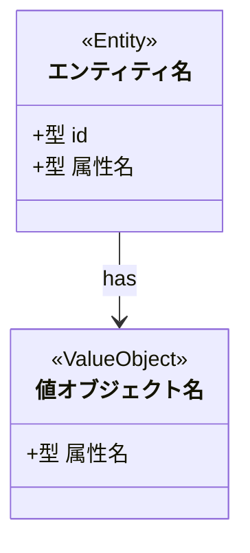
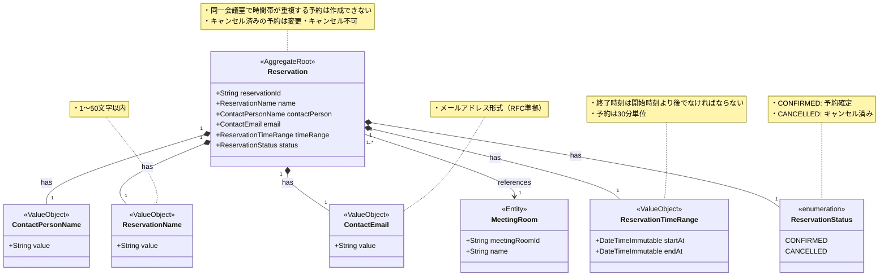

# ドメインモデル図生成スキル

このスキルは、prd-writingスキルで作成されたPRD（プロダクト要求定義書）と、ubiquitous-languageスキルで管理されているユビキタス言語一覧をもとに、指定されたビジネスサブドメインのドメインモデル図をMermaid記法で生成・更新します。

## 起動時の共通処理

### 1. サブドメイン名の解決

`resolve-subdomain` スキルを呼び出してビジネスサブドメインの英語名を取得します:

```
Skill("resolve-subdomain", "$1")
```

取得した `<英語名>` を以降のすべてのファイルパスで使用します。このステップの結果はモード1の「ユビキタス言語の読み込み」ステップでも再利用します。

### 2. モードの自動判別

`docs/<英語名>/domain-model.mmd` の存在を確認し、実行するモードを決定します。

- **ファイルが存在しない** → モード1（新規作成）を実行する
- **ファイルが存在する** → モード2（更新）を実行する。

---

## モード1: ドメインモデル図新規作成

### 目的

PRD（プロダクト要求定義書）とubiquitous-languageスキルで管理されているユビキタス言語一覧をもとに、ドメインモデル図を**新規作成**します。

### 入力

- **ビジネスサブドメイン名**: 引数として渡される（例: `予約管理`、`会議室管理`）
- **PRDファイル**: `docs/<英語名>/product-requirements.md`

### 出力先

```
docs/<英語名>/domain-model.mmd
```

### 実行手順

#### 1. PRDファイルの読み込み

以下のパスにあるPRDファイルを読み込みます:

```
docs/<英語名>/product-requirements.md
```

ファイルが存在しない場合は、ユーザーに以下のメッセージを伝えてください:

```
docs/<英語名>/product-requirements.md が見つかりません。
prd-writingスキルでPRDを先に作成してください。
```

#### 3. ユビキタス言語の読み込み

`ubiquitous-finder` サブエージェントを呼び出して、対象サブドメインのユビキタス言語一覧を取得します。

```
Agent(ubiquitous-finder, "ビジネスサブドメイン: <ビジネスサブドメイン名>")
```

サブエージェントが「該当なし」を返した場合は、ユーザーに以下のメッセージを伝えてください:

```
指定されたビジネスサブドメイン「<ビジネスサブドメイン名>」に該当するユビキタス言語は見つかりませんでした。
ドメインモデル図の生成にはユビキタス言語の情報が必要です。
ユビキタス言語集に用語を追加するか、正しいサブドメイン名を指定して再度お試しください。
```

#### 4. ドメイン概念の抽出

PRDとユビキタス言語一覧を分析し、以下の要素を抽出します。

##### 除外ルール（最優先）

以下に該当する概念は**ドメインモデル図に記載しない**でください:

- **表示用のReadモデル**（例: `ReservationListItem`, `RoomAvailabilityView`, `BookingSummary` など、画面やAPIレスポンスの形に合わせたDTO・ViewModel・QueryResult）
- ビジネスロジックや不変条件を持たず、**データの読み取り・整形のみ**を目的とするオブジェクト
- `*View`, `*DTO`, `*Response`, `*Summary`, `*ListItem` のような命名で、集約や値オブジェクトを横断してデータを集めているもの

ドメインモデルは**ビジネスルールと不変条件を表現するもの**です。表示・検索・レポートのためだけに存在するオブジェクトは含めないでください。

##### エンティティ（Entity）の抽出ルール

以下に該当する概念をエンティティとして扱います:
- **一意のID**を持つドメインオブジェクト（例: 予約ID、会議室IDなど）
- PRDの機能要件で「登録」「変更」「削除」の操作対象になるもの
- ユビキタス言語で英語名がパスカルケース（例: `Reservation`, `MeetingRoom`）で表された名詞
- 注意点として、なるべくエンティティではなく値オブジェクトとして表現できないかを検討してください。エンティティはドメインモデルの複雑さを増すため、必要最小限に留めることが望ましいです。

##### 値オブジェクト（Value Object）の抽出ルール

以下に該当する概念を値オブジェクトとして扱います:
- IDを持たず、**属性の組み合わせで識別**されるドメインオブジェクト
- PRDの受け入れ条件に「〜文字以内」「〜の形式」などのルールがあるもの（例: `ReservationName`, `ContactEmail`, `ReservationTimeRange`）
- 特定の集約に**所有**され、その集約の一部として扱われるもの（`*--` コンポジションで表現）

##### 仕様（Specification）の抽出ルール

以下に該当する概念を仕様として扱います:
- 特定の集約に所有されず、**システム全体またはドメイン全体に適用**されるビジネスルール・ポリシー
- 集約のバリデーション・制約チェックに使用される**外部ルール**（例: `ReservablePeriod`「当日〜14日以内のみ予約可能」）
- 全対象に**一律適用**される設定値・制約（例: `BufferTime`「10分間バッファ」）
- 集約との関係が `-->` （依存）であり、`*--`（コンポジション）ではないもの

> **ValueObject と Specification の見分け方**:  
> 集約が「所有する」ならValueObject（`*--`）、集約が「参照してルールを適用する」ならSpecification（`-->`）

##### 集約（Aggregate）の判断ルール

以下の観点で集約ルートを判断します:
- エンティティのうち、他のエンティティや値オブジェクトを**まとめて管理する中心的なオブジェクト**
- PRDの機能要件でCRUD操作の主語になるエンティティ
- ユビキタス言語で「〜を管理する」「〜を登録する」の対象として記述されているもの

##### 関連（Relationship）の抽出ルール

PRDのユーザーストーリーと受け入れ条件から、以下の関係を抽出します:
- エンティティ間の「持つ（has）」「属する（belongs to）」関係
- 値オブジェクトがどのエンティティや集約に属するか
- 集約間の参照関係（IDによる参照）

##### ビジネスルール・不変条件の抽出ルール

各オブジェクトについて、PRDの受け入れ条件・制約・ビジネスロジックからビジネスルールと不変条件を抽出します:

**記載してほしいビジネスルール**:
- 集約全体の整合性を保つためのルール（例: 「終了時刻は開始時刻より後でなければならない」）
- 状態遷移に関するルール（例: 「キャンセル済みの予約は変更できない」）
- 集約内オブジェクト間の制約（例: 「同一会議室で時間帯が重複する予約は作成できない」）
- フォーマット・文字数などの制約（例: 「1〜50文字」「メール形式」）
- 値の範囲や論理的な制約（例: 「開始日 < 終了日」「正の整数のみ」）
- 不変条件（生成後に変更できない理由など）

各オブジェクトに対応する吹き出しにこれらを記載してください。
**ルールは簡潔な箇条書き形式で記述し、ドメインモデル図を見ただけでビジネスルールが理解できるようにしてください。(重要)**

#### 5. Mermaidドメインモデル図の生成

以下のフォーマットに従ってMermaidのクラス図（`classDiagram`）でドメインモデル図を生成します。



##### 生成ルール

1. **クラスの表現**
   - エンティティには `<<Entity>>` ステレオタイプを付与する
   - 集約ルートには `<<AggregateRoot>>` ステレオタイプを付与する
   - 値オブジェクトには `<<ValueObject>>` ステレオタイプを付与する
   - 仕様には `<<Specification>>` ステレオタイプを付与する

2. **属性の記述**
   - 属性名はユビキタス言語の英語名（パスカルケース）を使用する
   - 型は `String`, `Int`, `DateTimeImmutable`, `Boolean` などシンプルな型で表現する
   - `Status`, `Type`, `State` など有限の選択肢を持つ状態・区分を表す属性は `String` ではなく `enum` 型（例: `ReservationStatus`）で表現する
   - IDは必須属性として先頭に記述する

3. **関連の記述**
   - 集約内の関連（インスタンス参照）: `*--` （コンポジション ◆－）
   - 集約間の参照（ID参照）: `-->` （矢印 →）
   - 集約から仕様への依存: `-->` （矢印 →）、ラベルは `validates with`, `applies` など意味を表す動詞句を使う
   - **多重度を必ず記載する**（ER図作成の参考になるよう、関連の両端に多重度を付与する）
     - 記法: `ClassA "多重度" --> "多重度" ClassB : label`
     - 例: `Reservation "1" --> "1..*" ReservationItem : has`
     - 主な多重度の表現: `1`（1件）、`0..1`（0または1件）、`1..*`（1件以上）、`0..*`（0件以上）、`*`（0件以上、`0..*` と同義）
   - ラベルに関係の動詞（`has`, `belongs to`, `references`）を付ける

4. **クラス名の命名規則**
   - ユビキタス言語の英語名（パスカルケース）を使用する
   - 英語名がない場合は日本語名をそのまま使用する

5. **ビジネスルール・不変条件の吹き出し**
   - 集約ルート・値オブジェクト・エンティティそれぞれに、抽出したビジネスルールを `note for` 構文で吹き出しとして付与する
   - 複数のルールは**実際の改行**で区切って列挙する（`\n` リテラルは使用しない）
   - ビジネスルールが存在しないオブジェクトには `note for` を付けない
   - 吹き出しの内容は日本語で記述し、簡潔な箇条書き形式（`・ルール内容`）にする

   ```mermaid
   note for クラス名 "・不変条件1
・不変条件2
・制約3"
   ```

##### 生成例



#### 6. ファイルの保存

出力先ディレクトリが存在しない場合は作成し、生成したMermaidコードを以下のパスに保存します:

```
docs/<英語名>/domain-model.mmd
```

保存後、ユーザーに以下のメッセージを伝えてください:

```
ドメインモデル図を docs/<英語名>/domain-model.mmd に保存しました。

Mermaid対応のエディタ（VSCode + Mermaid拡張、Mermaid Live Editorなど）でプレビューできます。
```

### 使い方・実行イメージ

Claude Codeを起動し、以下のようにビジネスサブドメイン名を渡して話しかけるだけです。

**入力例:**
```
/domain-model 予約管理
/domain-model 会議室管理
/domain-model 決済
```

---

## モード2: ドメインモデル図の更新

### 目的

`ubiquitous-language`スキルで管理されているユビキタス言語一覧と既存のドメインモデル図を照合し、図を最新の状態に更新します。既存の記述も含めて自由に変更・追記できます。

### 入力

- **ビジネスサブドメイン名**: 引数として渡される（例: `予約管理`、`会議室管理`）
- **既存ドメインモデル図**: `docs/<英語名>/domain-model.mmd`

### 出力先

```
docs/<英語名>/domain-model.mmd（上書き更新）
```

### 実行手順

#### 1. 既存ドメインモデル図の読み込み

`docs/<英語名>/domain-model.mmd` を読み込みます。

#### 2. ユビキタス言語の読み込み

`ubiquitous-finder` サブエージェントを呼び出して、対象サブドメインのユビキタス言語一覧を取得します。

```
Agent(ubiquitous-finder, "ビジネスサブドメイン: <ビジネスサブドメイン名>")
```

サブエージェントが「該当なし」を返した場合は、ユーザーに以下のメッセージを伝えてください:

```
指定されたビジネスサブドメイン「<ビジネスサブドメイン名>」に該当するユビキタス言語は見つかりませんでした。
ユビキタス言語集に用語を追加するか、正しいサブドメイン名を指定して再度お試しください。
```

#### 4. 差分の特定

ユビキタス言語一覧と既存ドメインモデル図を照合し、**図に未反映の用語**を特定します。

判定基準:
- ユビキタス言語の英語名（パスカルケース）がドメインモデル図のクラス名として存在しない → **未反映**
- 英語名がなく、日本語名もクラス名として存在しない → **未反映**
- すでにクラスや関連として記載されている → **反映済み（スキップ）**

未反映の用語がひとつもない場合は、更新を行わずユーザーに以下のメッセージを伝えてください:

```
ユビキタス言語一覧はすべてドメインモデル図に反映されています。更新は不要です。
```

#### 5. 追記内容の決定

未反映の用語について、モード1の「ドメイン概念の抽出ルール」（**除外ルールを含む**エンティティ・値オブジェクト・集約・関連・ビジネスルールの各判断ルール）に従い、追記するクラス・関連・`note for`を決定します。表示用のReadモデルに該当する用語は追記しないでください。

#### 6. ファイルの更新

モード1の「Mermaidドメインモデル図の生成」ルールに従い、既存の内容と追記・変更内容をまとめてドメインモデル図を再生成し、ファイルを上書き保存します。既存の記述も必要に応じて自由に変更・削除できます。

保存後、ユーザーに以下のメッセージを伝えてください:

```
ドメインモデル図を更新しました: docs/<英語名>/domain-model.mmd

【変更内容】
- 追記したクラス: <追記したクラス名一覧（なければ省略）>
- 変更したクラス: <変更したクラス名一覧（なければ省略）>
- 追記した関連: <追記した関連一覧（なければ省略）>
```

### 使い方・実行イメージ

モード1・モード2ともに入力形式は同じです。ファイルの存在によって自動的にモードが判別されます。

**入力例:**
```
/domain-model 予約管理
/domain-model 会議室管理
```
