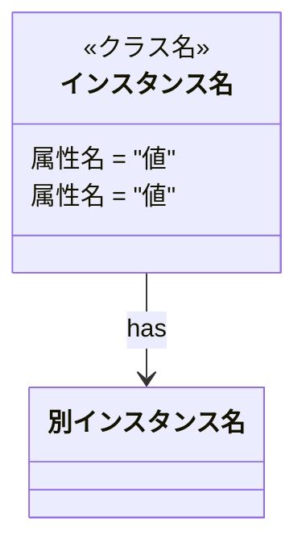
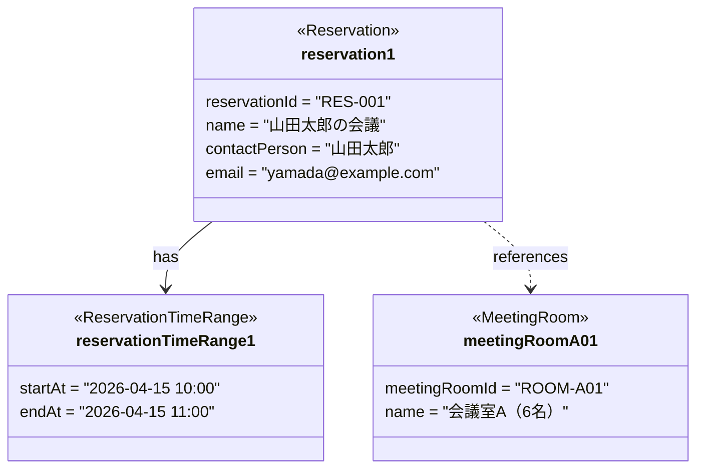

# オブジェクト図生成スキル

このスキルは、domain-modelスキルで作成されたドメインモデル図（`domain-model.mmd`）をもとに、指定されたビジネスサブドメインのオブジェクト図をMermaid記法で自動生成します。

## 起動時の共通処理

### 1. サブドメイン名の解決

`resolve-subdomain` スキルを呼び出してビジネスサブドメインの英語名を取得します:

```
Skill("resolve-subdomain", "$1")
```

取得した `<英語名>` を以降のすべてのファイルパスで使用します。

### 2. モードの自動判別

`docs/<英語名>/object-diagram.mmd` の存在を確認し、実行するモードを決定します。

- **ファイルが存在しない** → モード1（新規作成）を実行する
- **ファイルが存在する** → モード2（更新）を実行する

---

## モード1: オブジェクト図新規作成

### 目的

ドメインモデル図をもとに、オブジェクト図を**新規作成**します。

### 入力

- **ビジネスサブドメイン名**: 引数として渡される（例: `予約管理`、`会議室管理`）
- **ドメインモデル図ファイル**: `docs/<英語名>/domain-model.mmd`

### 出力先

```
docs/<英語名>/object-diagram.mmd
```

### 実行手順

#### 1. ドメインモデル図ファイルの読み込み

以下のパスにあるドメインモデル図ファイルを読み込みます:

```
docs/<英語名>/domain-model.mmd
```

ファイルが存在しない場合は、ユーザーに以下のメッセージを伝えてください:

```
docs/<英語名>/domain-model.mmd が見つかりません。
domain-modelスキルでドメインモデル図を先に作成してください。
```

#### 2. クラス・属性の分析

ドメインモデル図を分析し、以下の要素を把握します:

##### 分析対象

- `<<AggregateRoot>>` を持つクラス → 中心となるオブジェクトインスタンスを生成
- `<<Entity>>` を持つクラス → エンティティのインスタンスを生成
- `<<ValueObject>>` を持つクラス → 値オブジェクトのインスタンスを生成（集約/エンティティに埋め込み）
- `<<Specification>>` を持つクラス → 仕様のインスタンスを生成し、依存元集約との関連として表現
- `<<enumeration>>` を持つクラス → 属性値の選択肢として参照するのみ（独立したインスタンスは生成しない）
- クラス間の `*--`（コンポジション）の関連 → 集約内インスタンス間のリンクとして表現（インスタンスを集約に埋め込む）
- クラス間の `-->` の関連 → 集約間参照または仕様への依存リンクとして表現

##### サンプル値の生成ルール

クラス名・属性名・ドメインコンテキストから推測して、現実的なサンプル値を設定します:

| 属性の型・意味 | サンプル値の例 |
|---|---|
| ID系（`id`, `Id`で終わる属性） | `"RES-001"`, `"ROOM-A01"` のようなプレフィックス付き文字列 |
| 名前・名称系 | ドメインに合った日本語の具体例 |
| メールアドレス | `"yamada@example.com"` のような形式 |
| 日時・期間 | `"2026-04-15 10:00"`, `"2026-04-15 11:00"` のような具体的な日時 |
| 数値・数量 | ドメインに合った現実的な数値 |
| 真偽値 | `true` または `false` |
| 状態・ステータス | ドメインモデル図に定義された状態値 |

#### 3. Mermaidオブジェクト図の生成

Mermaidの `classDiagram` を使用して、クラスではなくオブジェクト（インスタンス）を表現します。

##### 記法ルール

1. **オブジェクト名の命名規則**
   - クラス名をキャメルケースにしてインスタンス番号を付与する（例: `reservation1`, `meetingRoomA01`）
   - 関連するオブジェクトが複数ある場合は連番を付ける（例: `timeRange1`）

2. **ステレオタイプの表現**
   - クラスのステレオタイプをインスタンスのクラス名として表示する
   - 例: `<<Reservation>>`, `<<MeetingRoom>>`

3. **属性の表現**
   - `属性名 = "値"` 形式で具体的なサンプル値を記述する
   - 文字列は `"値"` で囲む
   - 数値・真偽値はクォートなしで記述する

4. **関連の表現**
   - ドメインモデル図の `*--`（コンポジション）関係 → `-->` でインスタンス間を接続（集約内参照）
   - ドメインモデル図の `-->` 関係 → `-->` でインスタンス間を接続（集約間参照・仕様依存）
   - ラベルはドメインモデル図の関連ラベルをそのまま使用する

##### フォーマット



##### 生成例



#### 4. ファイルの保存

出力先ディレクトリが存在しない場合は作成し、生成したMermaidコードを以下のパスに保存します:

```
docs/<英語名>/object-diagram.mmd
```

保存後、ユーザーに以下のメッセージを伝えてください:

```
オブジェクト図を docs/<英語名>/object-diagram.mmd に保存しました。

生成したオブジェクト:
- [インスタンス名一覧]

Mermaid対応のエディタ（VSCode + Mermaid拡張、Mermaid Live Editorなど）でプレビューできます。
```

### 使い方・実行イメージ

Claude Codeを起動し、以下のようにビジネスサブドメイン名を渡して話しかけるだけです。

**入力例:**
```
/object-diagram 予約管理
/object-diagram 会議室管理
/object-diagram 決済
```

---

## モード2: オブジェクト図の更新

### 目的

最新のドメインモデル図と既存のオブジェクト図を照合し、図を最新の状態に更新します。既存の記述も含めて自由に変更・追記できます。

### 入力

- **ビジネスサブドメイン名**: 引数として渡される（例: `予約管理`、`会議室管理`）
- **既存オブジェクト図**: `docs/<英語名>/object-diagram.mmd`
- **ドメインモデル図ファイル**: `docs/<英語名>/domain-model.mmd`

### 出力先

```
docs/<英語名>/object-diagram.mmd（上書き更新）
```

### 実行手順

#### 1. 既存オブジェクト図の読み込み

`docs/<英語名>/object-diagram.mmd` を読み込みます。

#### 2. ドメインモデル図の読み込み

`docs/<英語名>/domain-model.mmd` を読み込みます。

ファイルが存在しない場合は、ユーザーに以下のメッセージを伝えてください:

```
docs/<英語名>/domain-model.mmd が見つかりません。
domain-modelスキルでドメインモデル図を先に作成してください。
```

#### 3. 差分の特定

ドメインモデル図のクラスと既存オブジェクト図を照合し、**図に未反映のクラス**を特定します。

判定基準:
- ドメインモデル図のクラス名（英語名）に対応するステレオタイプ（`<<クラス名>>`）を持つインスタンスがオブジェクト図に存在しない → **未反映**
- すでにインスタンスとして記載されている → **反映済み（スキップ）**

未反映のクラスがひとつもない場合は、更新を行わずユーザーに以下のメッセージを伝えてください:

```
ドメインモデル図のすべてのクラスがオブジェクト図に反映されています。更新は不要です。
```

#### 4. 追記内容の決定

未反映のクラスについて、モード1の「クラス・属性の分析」「サンプル値の生成ルール」「記法ルール」に従い、追記するインスタンスと関連を決定します。

#### 5. ファイルの更新

モード1の「クラス・属性の分析」「記法ルール」に従い、既存の内容と追記・変更内容をまとめてオブジェクト図を再生成し、ファイルを上書き保存します。既存の記述も必要に応じて自由に変更・削除できます。

保存後、ユーザーに以下のメッセージを伝えてください:

```
オブジェクト図を更新しました: docs/<英語名>/object-diagram.mmd

【変更内容】
- 追記したインスタンス: <追記したインスタンス名一覧（なければ省略）>
- 変更したインスタンス: <変更したインスタンス名一覧（なければ省略）>
- 関連: <追記・変更した関連一覧（なければ省略）>
```

### 使い方・実行イメージ

モード1・モード2ともに入力形式は同じです。ファイルの存在によって自動的にモードが判別されます。

**入力例:**
```
/object-diagram 予約管理
/object-diagram 会議室管理
```
