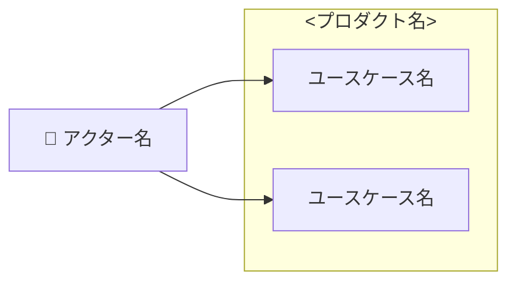
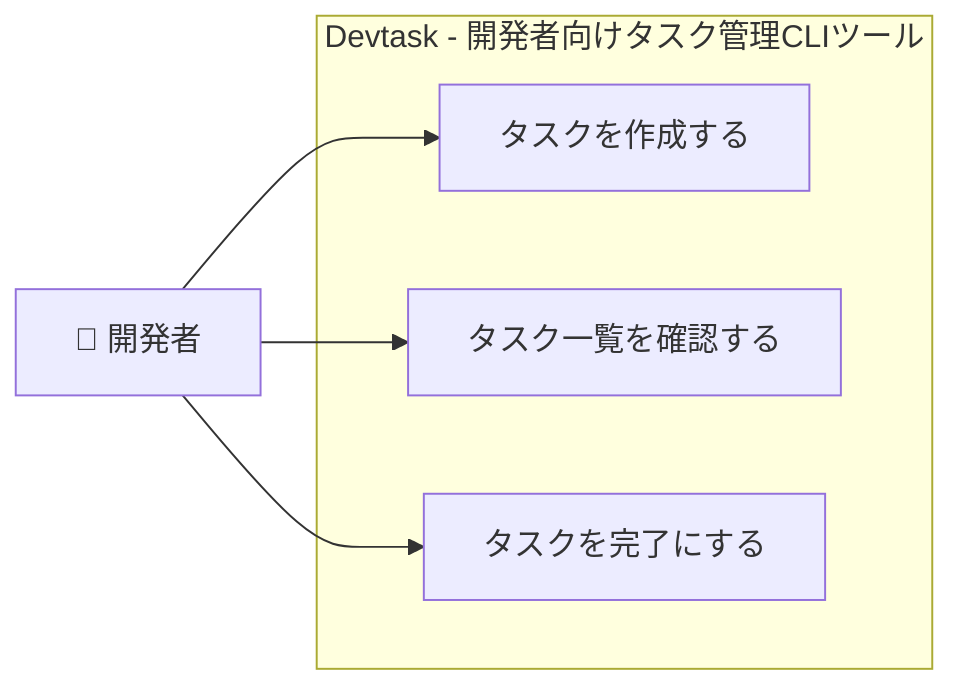

# ユースケース図生成スキル

このスキルは、prd-writingスキルで作成されたPRD（プロダクト要求定義書）の機能要件を解析し、Mermaidフォーマットのユースケース図を自動生成します。

## 起動時の共通処理

### 1. サブドメイン名の解決

`resolve-subdomain` スキルを呼び出してビジネスサブドメインの英語名を取得します:

```
Skill("resolve-subdomain", "$1")
```

取得した `<英語名>` を以降のすべてのファイルパスで使用します。

### 2. モードの自動判別

`docs/<英語名>/usecase.mmd` の存在を確認し、実行するモードを決定します。

- **ファイルが存在しない** → モード1（新規作成）を実行する
- **ファイルが存在する** → モード2（更新）を実行する

---

## モード1: ユースケース図新規作成

### 目的

PRD（プロダクト要求定義書）の機能要件を解析し、ユースケース図を**新規作成**します。

### 入力

- **ビジネスサブドメイン名**: 引数として渡される（例: `決済`、`在庫`）
- **PRDファイル**: `docs/<英語名>/product-requirements.md`

### 出力先

```
docs/<英語名>/usecase.mmd
```

### 実行手順

#### 1. PRDファイルの読み込み

以下のパスにあるPRDファイルを読み込みます:

```
docs/<英語名>/product-requirements.md
```

ファイルが存在しない場合は、ユーザーに以下のメッセージを伝えてください:

```
docs/<英語名>/product-requirements.md が見つかりません。
prd-writingスキルでPRDを先に作成してください。
```

#### 2. 機能要件の解析

PRDの「機能要件」セクションのうち、**コア機能(MVP)のみ**を対象に解析します。将来的な機能(Post-MVP)は対象外です。

抽出する情報:

- **アクター**: ユーザーストーリーに登場する主語（例: 「開発者として」→ 開発者）
- **ユースケース**: 各機能名とユーザーストーリーから導出する動詞句（例: 「タスクを作成する」）

##### アクターの抽出ルール

ユーザーストーリーの「〜として」の部分からアクターを抽出します。明示されていない場合は「ユーザー」をデフォルトのアクターとして使用します。複数のアクターが登場する場合は全員を含めます。

##### ユースケースの抽出ルール

- 機能名から「〜する」形式の動詞句を生成します
- ユーザーストーリーの「〜が欲しい」「〜できる」の部分からも抽出します
- **P0（必須）の機能のみ**を対象とします

#### 3. Mermaidユースケース図の生成

以下のフォーマットに従ってMermaidのユースケース図を生成します:



##### 生成ルール

1. **アクターの表現**
   - アクターはシステム外に配置する（サブグラフの外側）
   - 複数アクターはそれぞれ独立したノードとして定義する

2. **ユースケースの表現**
   - システム境界をサブグラフで表現する
   - サブグラフのラベルはPRDのプロダクト名を使用する
   - サブグラフは1つのみ（MVPのみ）

3. **ユースケース名の命名規則**
   - 「〜する」形式の動詞句で統一する（例: `タスクを作成する`、`優先度を設定する`）

##### 生成例



#### 4. ファイルの保存

出力先ディレクトリが存在しない場合は作成し、生成したMermaidコードを以下のパスに保存します:

```
docs/<英語名>/usecase.mmd
```

保存後、ユーザーに以下のメッセージを伝えてください:

```
ユースケース図を docs/<英語名>/usecase.mmd に保存しました。

抽出したユースケース:
- アクター: [アクター一覧]
- ユースケース: [ユースケース一覧]

Mermaid対応のエディタ（VSCode + Mermaid拡張、Mermaid Live Editorなど）でプレビューできます。
```

### 使い方・実行イメージ

Claude Codeを起動し、以下のようにビジネスサブドメイン名を渡して話しかけるだけです。

**入力例:**
```
/usecase-diagram タスク管理
/usecase-diagram 決済
/usecase-diagram 在庫
```

---

## モード2: ユースケース図の更新

### 目的

既存のユースケース図とPRDを照合し、図を最新の状態に更新します。既存の記述も含めて自由に変更・追記できます。

### 入力

- **ビジネスサブドメイン名**: 引数として渡される（例: `決済`、`在庫`）
- **既存ユースケース図**: `docs/<英語名>/usecase.mmd`
- **PRDファイル**: `docs/<英語名>/product-requirements.md`

### 出力先

```
docs/<英語名>/usecase.mmd（上書き更新）
```

### 実行手順

#### 1. 既存ユースケース図の読み込み

`docs/<英語名>/usecase.mmd` を読み込みます。

#### 2. PRDファイルの読み込み

`docs/<英語名>/product-requirements.md` を読み込みます。

ファイルが存在しない場合は、ユーザーに以下のメッセージを伝えてください:

```
docs/<英語名>/product-requirements.md が見つかりません。
prd-writingスキルでPRDを先に作成してください。
```

#### 3. 差分の特定

PRDのコア機能(MVP)のユースケースと既存ユースケース図を照合し、**図に未反映のユースケース**を特定します。

判定基準:
- PRDのユーザーストーリーから導出される動詞句が、既存図のユースケースノードのラベルに存在しない → **未反映**
- すでに同等の意味のユースケースがノードとして記載されている → **反映済み（スキップ）**

未反映のユースケースがひとつもない場合は、更新を行わずユーザーに以下のメッセージを伝えてください:

```
PRDのすべてのユースケースはすでに図に反映されています。更新は不要です。
```

#### 4. 追記内容の決定

未反映のユースケースについて、モード1の「機能要件の解析」ルールに従い、追記するノード・アクターとの関連線を決定します。

- 既存図に存在しないアクターが必要な場合は新規追加する

#### 5. ファイルの更新

モード1の「Mermaidユースケース図の生成」ルールに従い、既存の内容と追記・変更内容をまとめてユースケース図を再生成し、ファイルを上書き保存します。既存の記述も必要に応じて自由に変更・削除できます。

保存後、ユーザーに以下のメッセージを伝えてください:

```
ユースケース図を更新しました: docs/<英語名>/usecase.mmd

【変更内容】
- 追記したユースケース: [追記したユースケース一覧（なければ省略）]
- 変更したユースケース: [変更したユースケース一覧（なければ省略）]
- アクター: [追記・変更したアクター一覧（なければ省略）]
```

### 使い方・実行イメージ

モード1・モード2ともに入力形式は同じです。ファイルの存在によって自動的にモードが判別されます。

**入力例:**
```
/usecase-diagram タスク管理
/usecase-diagram 決済
```
